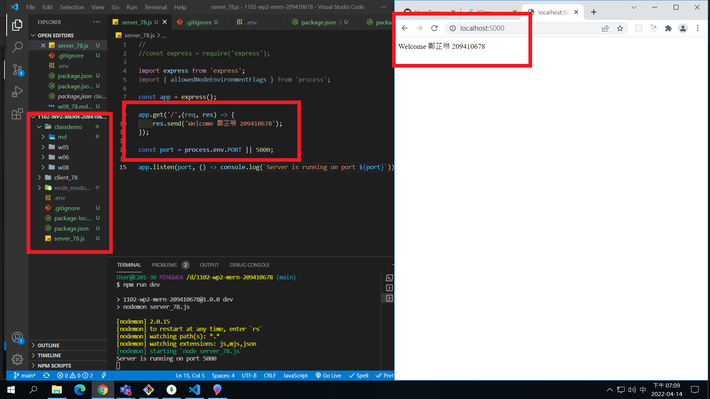
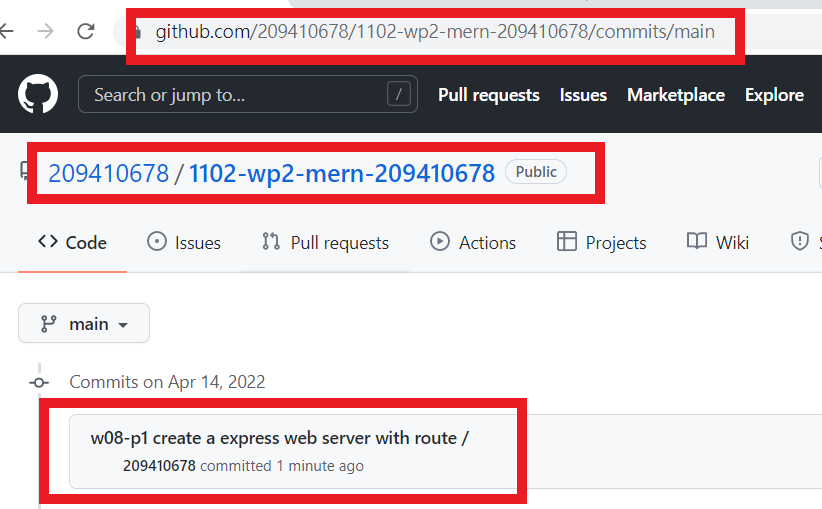
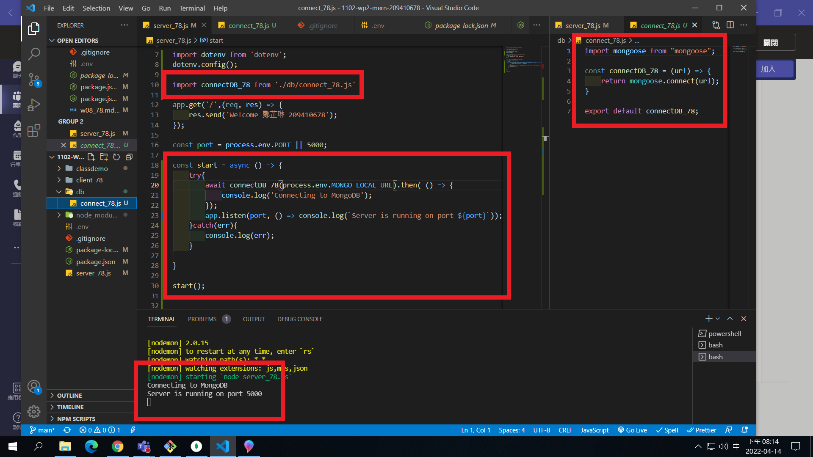
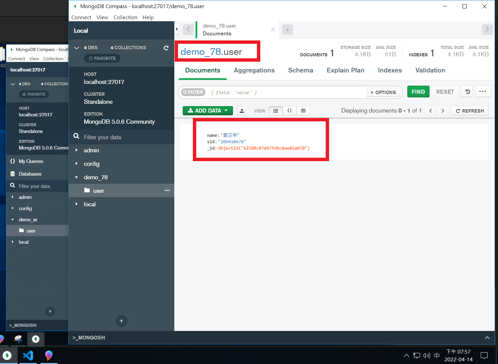
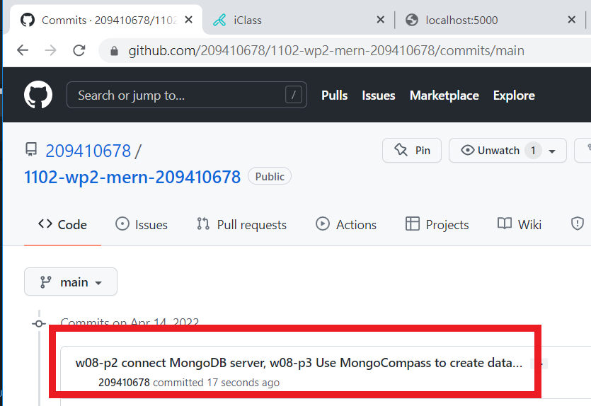
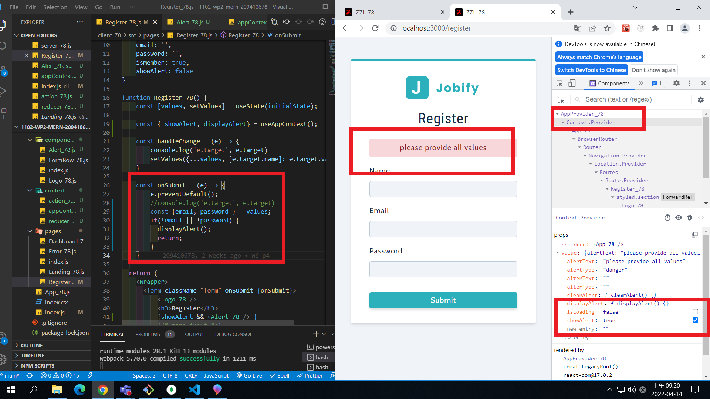
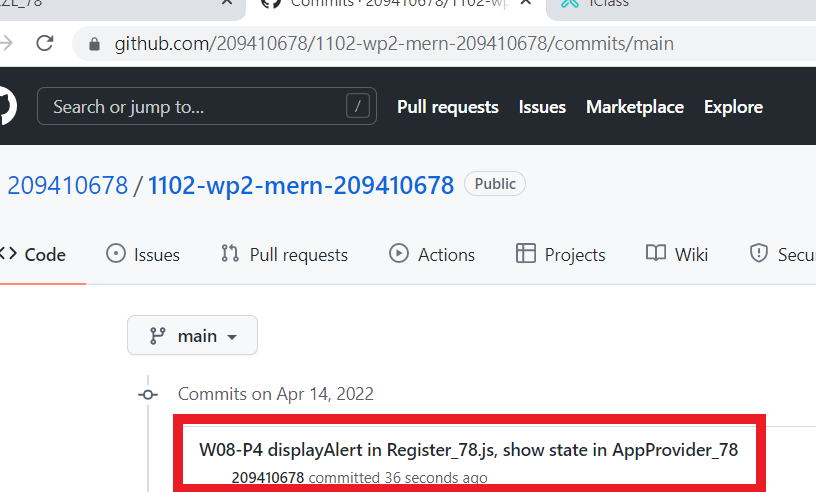

### w08-p1 create a express web server with route /

### w08-p2 connect MongoDB server

### w08-p3 Use MongoCompass to create database demo_78 and collection user,enter one document that has your name and sid

### W08-P4 displayAlert in Register_78.js, show state in AppProvider_78

