### w12-p1 switch Register and Login, and log

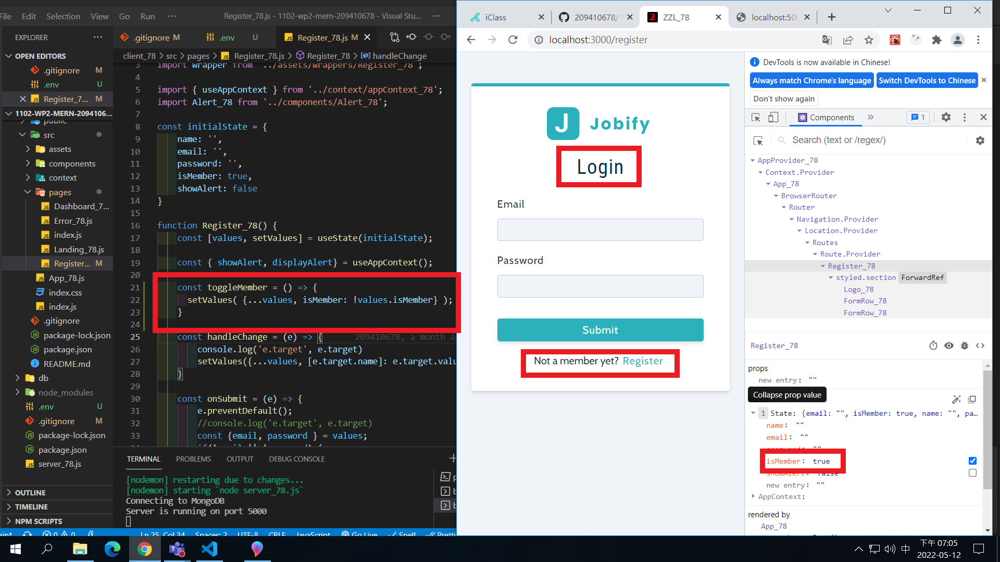

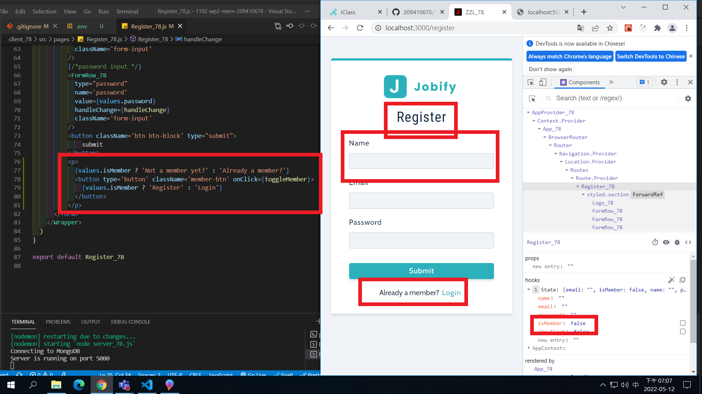

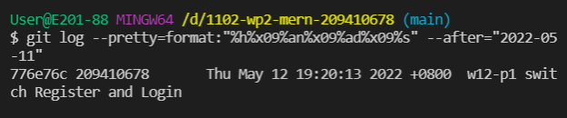

### w12-p2-1 test for notFoundMiddleware_78.js

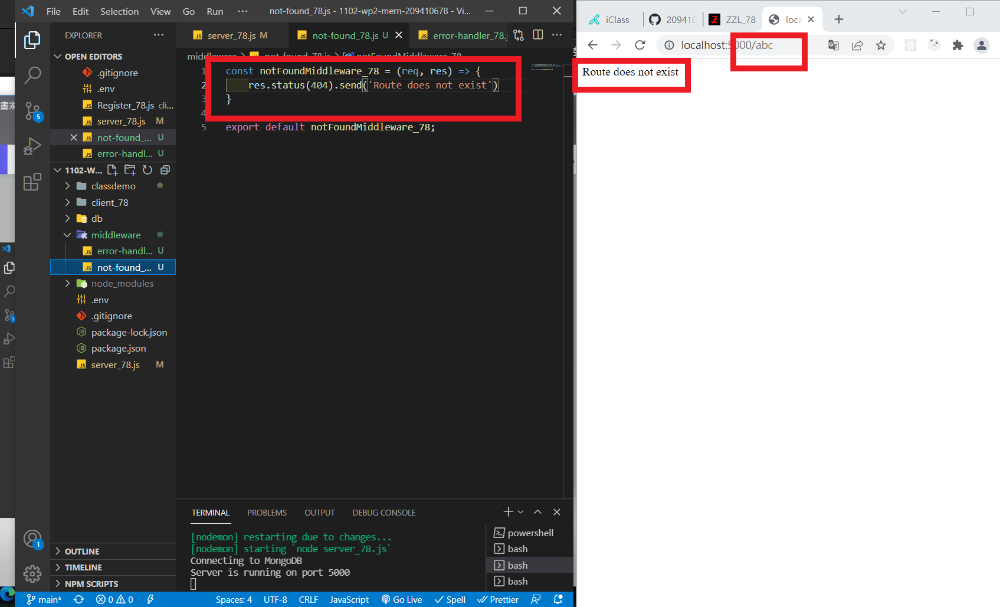

### w12-p2-2 test for errorHandlerMiddleware_78.js

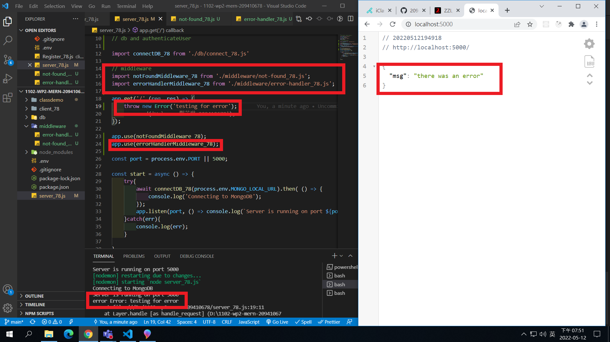

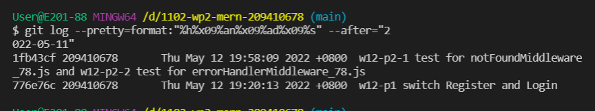

### w12-p3 Use postman to test route /api/v1/auth_78/register_78

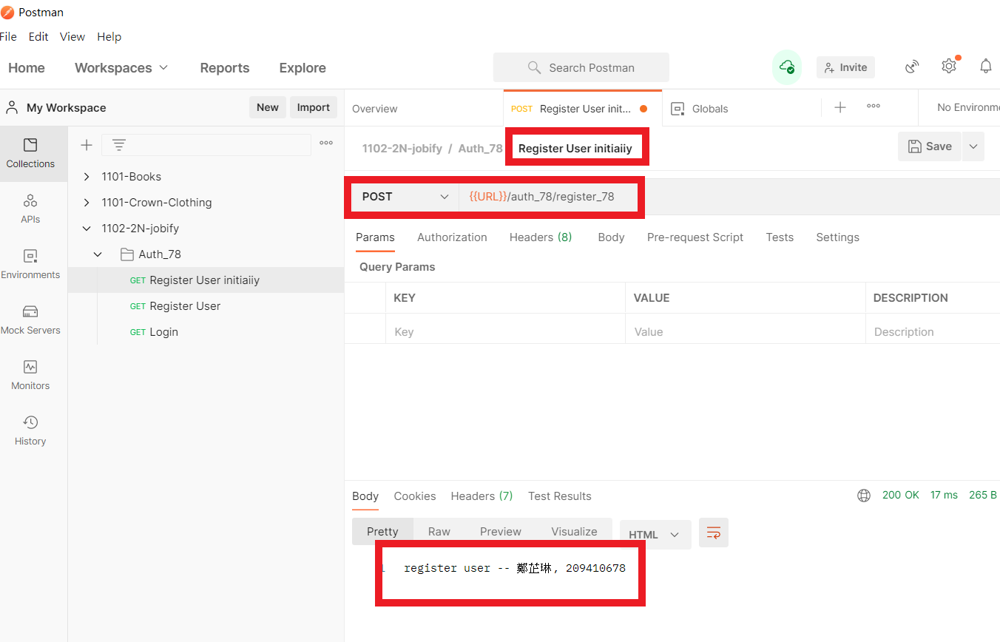

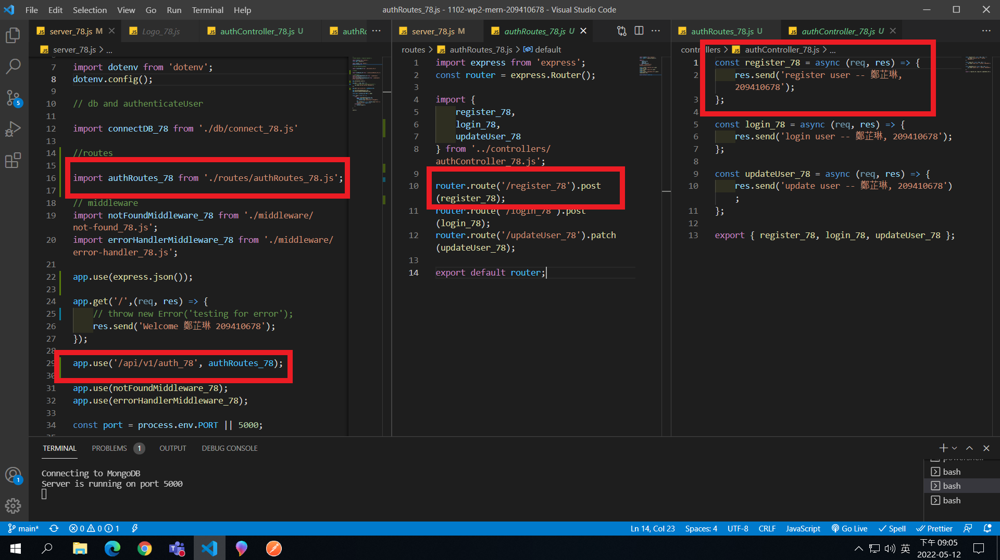

### w12-p4 Use postman to test route /api/v1/auth_78/login_78

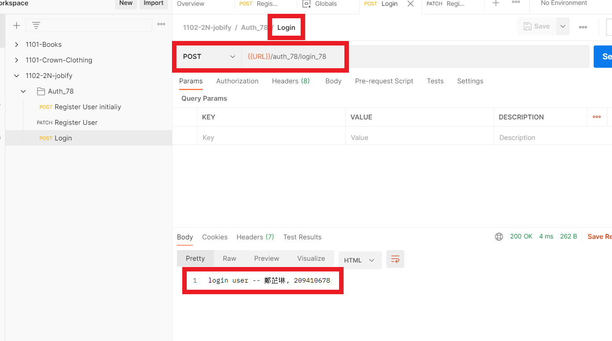

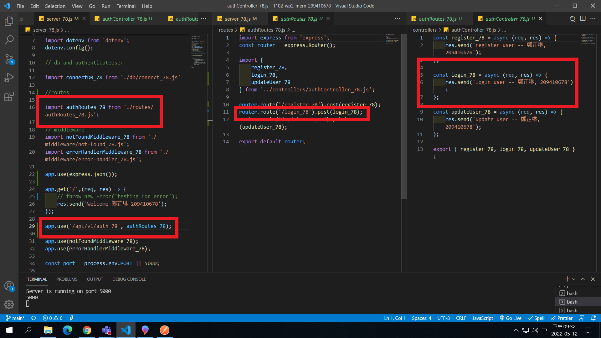

### w12-p5 Use postman to test route /api/v1/auth_78/updateUser_78

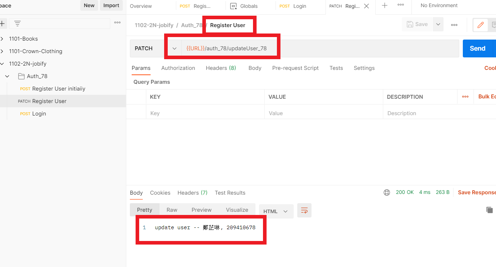

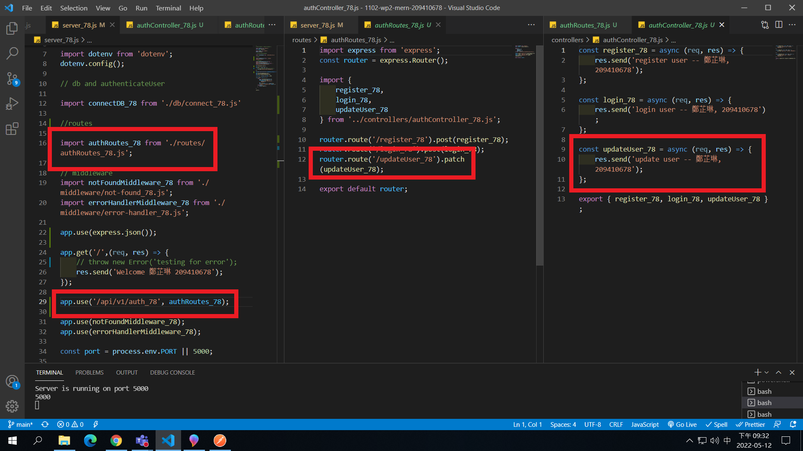

### W12-LAST-LOG show all W12 log records in Github

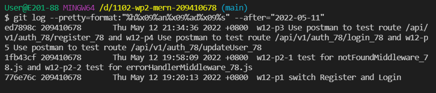

```
$ git log --pretty=format:"%h%x09%an%x09%ad%x09%s" --after="2022-05-11"
ed7898c 209410678       Thu May 12 21:34:36 2022 +0800  w12-p3 Use postman to test route /api/v1/auth_78/register_78 and w12-p4 Use postman to test route /api/v1/auth_78/login_78 and w12-p5 Use postman to test route /api/v1/auth_78/updateUser_78
1fb43cf 209410678       Thu May 12 19:58:09 2022 +0800  w12-p2-1 test for notFoundMiddleware_78.js and w12-p2-2 test for errorHandlerMiddleware_78.js
776e76c 209410678       Thu May 12 19:20:13 2022 +0800  w12-p1 switch Register and Login
```
