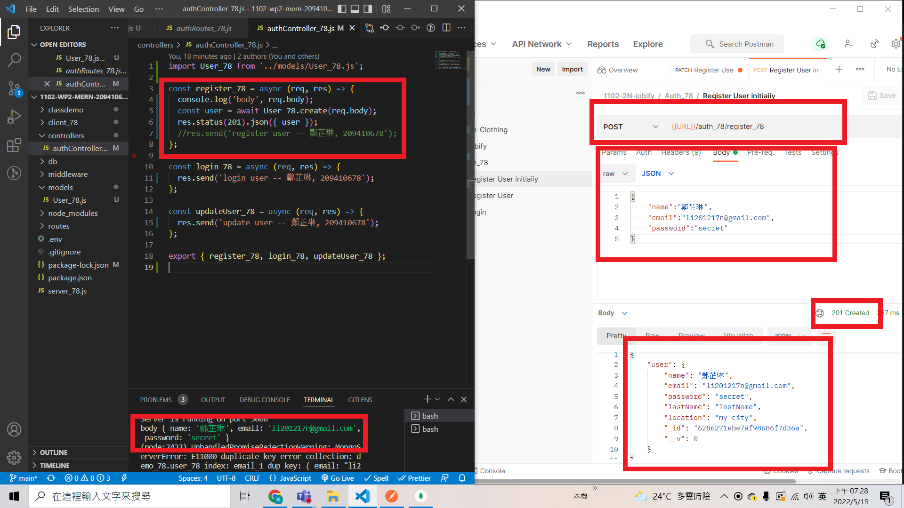
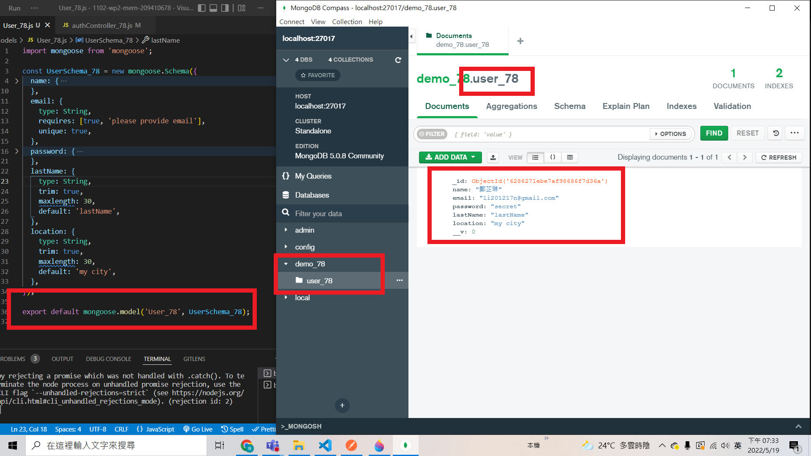
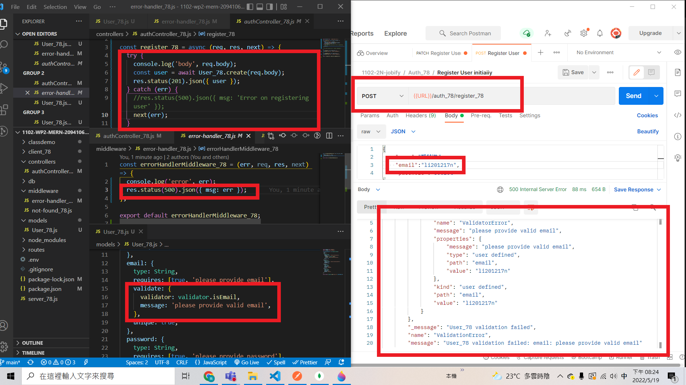
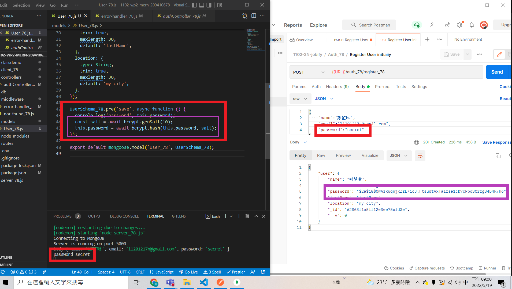
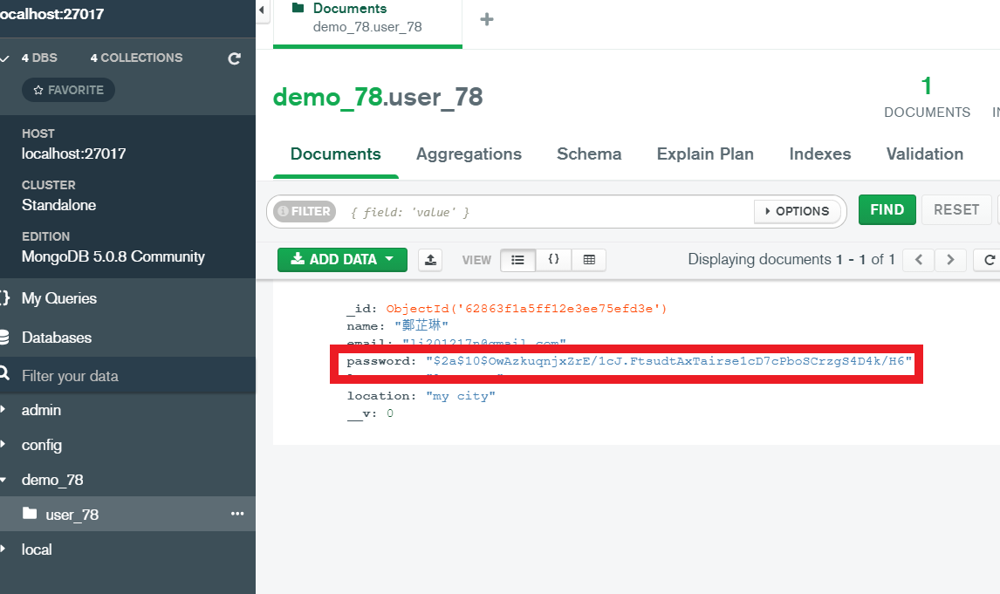
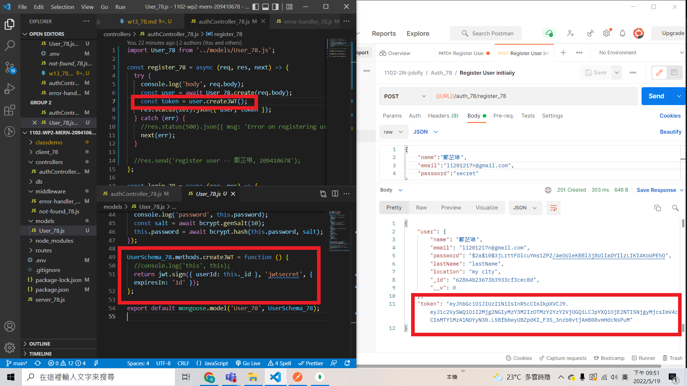
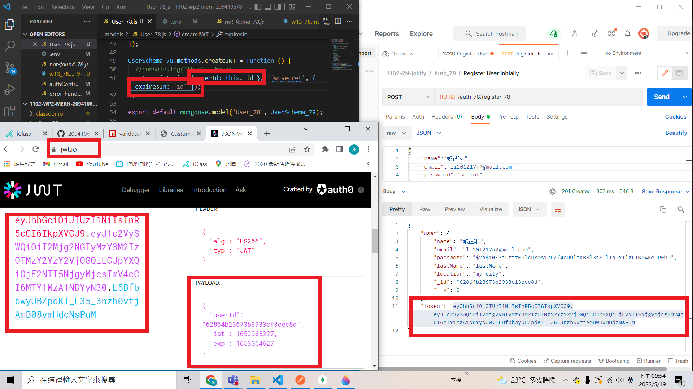
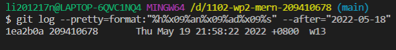

### Github repo URL

### w13-p1: create a user and save it into MongoDB, collection User_xx





### w13-p2: use validator package to check email, error sent to error-handler_xx.js



### w13-p3: hash password using bcryptjs





### w13-p4: create jwt token using bcryptjs





### p13-last-log



```

$ git log --pretty=format:"%h%x09%an%x09%ad%x09%s" --after="2022-05-18"
1ea2b0a 209410678       Thu May 19 21:58:22 2022 +0800  w13
```