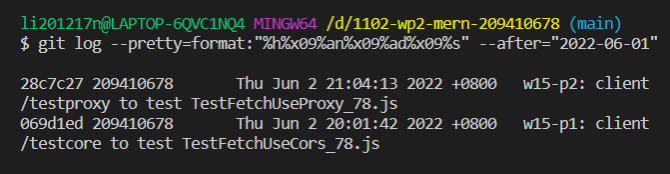

### w15-p1: client /testcore to test TestFetchUseCors_78.js


### w15-p2: client /testproxy to test TestFetchUseProxy_78.js


### w15-last-log



```
$ git log --pretty=format:"%h%x09%an%x09%ad%x09%s" --after="2022-06-01"
28c7c27 209410678       Thu Jun 2 21:04:13 2022 +0800   w15-p2: client /testproxy to test TestFetchUseProxy_78.js
069d1ed 209410678       Thu Jun 2 20:01:42 2022 +0800   w15-p1: client /testcore to test TestFetchUseCors_78.js
```